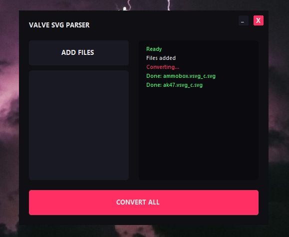

# Valve SVG Extractor

A simple tool designed to extract, center, and normalize vector graphics from compiled Valve binary files (`.vsvg_c`). 

## How it Works
The extractor parses the binary buffer to find the `svg_data`. It then cleans the XML metadata and calculates a transformation matrix.

## Usage
1.  Launch the tool.
2.  Click **ADD FILES** to select your `.vsvg_c` assets.
3.  Click **CONVERT ALL** to generate normalized `.svg` files.

  

